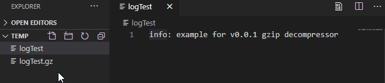
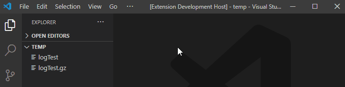
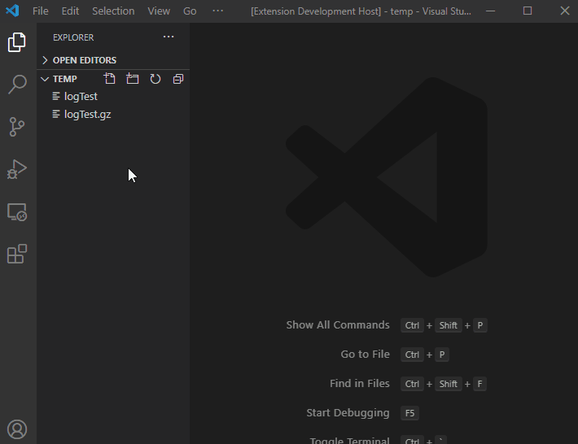
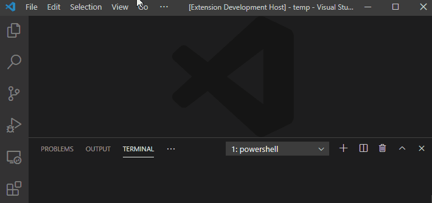

# GZIP Decompressor

gzip decompressor for Visual Studio Code

## Description

Display a text file in gzip

## Main Features

*gzip decompress button*

1. open *.gz file
2. click decompress button
   

*command palette*

1. open *command palette*.
2. select *gzip decompress*.
3. Enter the `absolute path` of the *gz file*.

*right click*

1. right click on the *.gz file* or open *.gz file* and right click on the *editor's title*
2. select *gzip decompress*.

*dialog*

1. open *command palette*.
2. select *Show content of the selected .gz in an Open dialog*.
3. Select the gz file you want to see its contents.

## Installation

1. Install *Visual Studio Code*
2. Launch *Code*
3. From the command palette `ctrl+shift+p` (Windows, Linux) or `cmd+shift+p` (OS X)
4. Select `Install Extension`
5. Choose the extension `Gzip Decompressor`
6. Reload *Visual Studio Code*

## License

[MIT](LICENSE)
